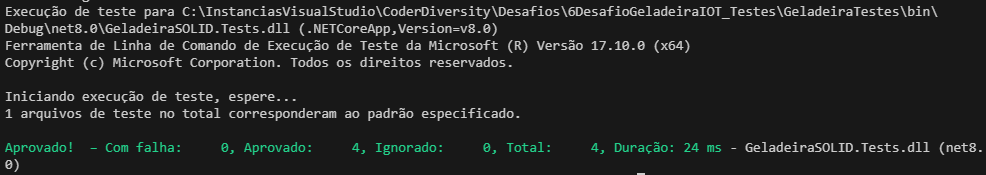

### **Códigos gerados usando VScode**

<a id="documentacao"></a>
<h1 align="center">
    Programa CodeRDIversity - 4° Projeto<br>    
</h1>
<p align="center">
       
</center>
<p align="center">
     
</center>

# GeladeiraAPI

## 🤖Introdução
Este repositório possui os Projetos relacionado à sexta semana durante o programa.
Para os projetos desenvolvidos nesse repositório foi utilizado a ferramente **VSCode**.

## 🚀Proposta do desafio:
### 🖱️  Testes Unitários - Projeto Geladeira SOLID
Este documento detalha a configuração e execução dos testes unitários implementados para o projeto Geladeira SOLID, que utiliza o framework .NET 8 e foi desenvolvido com o VSCode.

## 🖱️Configuração do Ambiente

### Pré-requisitos

- .NET 6 SDK ou superior
- SQL Server
- Visual Studio Code ou Visual Studio

## Estrutura do Projeto de Testes
O projeto de testes unitários foi criado utilizando o framework xUnit. Além disso, o Moq foi utilizado para realizar mocks dos repositórios durante os testes, garantindo que as dependências externas fossem simuladas de forma eficiente.

## Configuração do Projeto de Testes
As classes de testes estão localizadas na pasta GeladeiraSOLID.Tests. Para configurar o ambiente de testes, siga os passos abaixo:
   
1. **Instalar dependências do projeto de testes:**:
```
dotnet add package xunit
dotnet add package Moq
dotnet add package Microsoft.NET.Test.Sdk
dotnet add package xunit.runner.visualstudio
```  
2. **Criar o projeto de testes: O projeto de testes foi criado com o comando:**:  
```  
dotnet new xunit -n GeladeiraSOLID.Tests  
```  
3. **Configurar referência ao projeto principal: Adicione uma referência ao projeto principal no arquivo .csproj do projeto de testes:**:
```  
dotnet add reference ../GeladeiraSOLID/GeladeiraSOLID.csproj
```     

## Alguns Testes Implementados
1. Validação de Itens Expirados
Testa se o método GetExpiredItems retorna corretamente os itens que têm a data de validade anterior à data atual.
```
[Fact]
public async Task Item_Validity_ShouldReturnFalse_WhenExpired()
{
    // Arrange
    var mockItems = new List<Item>
    {
        new Item { Nome = "Alface", Categoria = "Hortifruti", Prateleira = 1, Container = 1, Posicao = 1, Validade = DateTime.UtcNow.AddDays(-1) }
    };

    _mockRepo.Setup(repo => repo.GetAllAsync()).ReturnsAsync(mockItems);

    // Act
    var expiredItems = await _itemService.GetExpiredItems();

    // Assert
    Assert.Single(expiredItems); // Validade anterior à data atual, deve retornar um item
}
```
2. Validação de Itens Válidos
Testa se o método GetAllItemsAsync retorna corretamente os itens com validade superior à data atual.
```
[Fact]
public async Task Item_Validity_ShouldReturnTrue_WhenValid()
{
    // Arrange
    var mockItems = new List<Item>
    {
        new Item { Nome = "Alface", Categoria = "Hortifruti", Prateleira = 1, Container = 1, Posicao = 1, Validade = DateTime.UtcNow.AddDays(1) }
    };

    _mockRepo.Setup(repo => repo.GetAllAsync()).ReturnsAsync(mockItems);

    // Act
    var items = await _itemService.GetAllItemsAsync();
    var validItem = items.FirstOrDefault(i => i.Nome == "Alface");

    // Assert
    Assert.NotNull(validItem);
    Assert.True(validItem.Validade > DateTime.UtcNow); // A validade é futura, o item deve ser válido
}
```   

### 🖱️ Como Executar os Testes
Use o comando abaixo na raiz do projeto:
```  
dotnet test
```  
Este comando irá:

Compilar o projeto.
Executar todos os testes definidos no projeto de testes.
Exibir um resumo dos resultados no terminal.

## Resultado Esperado
Todos os testes devem passar com sucesso, indicando que os métodos de validação de itens expirados e válidos estão funcionando conforme o esperado.
Exemplo de resultado obtido:


## 📄Tecnologias Utilizadas  
- **.NET 8**: Framework utilizado para a construção da API.
- **C#**: Linguagem criada pela Microsoft utilizada para criação e execução de programas.  
- **VSCode**: Utilizado para criação das Soluções, Projetos e Códigos.  
- **GIT**: Utilizado para o versionamento de código e documentação.  
- **.NET**: Framework desenvolvido pela Microsoft com várias funcionalidades.  
- **Entity Framework Core**: Para gerenciamento de banco de dados.
- **Swagger**: Para a documentação da API.
- **SOLID**: Princípios de design seguidos no projeto.
- **xUnit**: Para criação de testes
- **Mock**: Para simular conteúdo para os testes
- Opcional: **Visual Studio**: IDE, mais performática que o VSCode para programas desenvolvidos em C#.  

## 📰 Referências e Materiais Extras:  
✴ Documentação do C# e .NET.  
✴ Livros e recursos online sobre a linguagem e o framework.  
✴ Orientações das aulas.  

## 📄Conclusão
Este desafio buscou promover o aprendizado da implantação de uma API, além da prática da liguagem C# e do framework .NET. 
Se você está interessado em contribuir ou aprender mais sobre o assunto, sinta-se à vontade para contribuir! 🚀  

## 💌Como Contribuir:  
Fique à vontade para sugerir melhorias no modelo da API ou na documentação.  
Caso encontre algum problema ou tenha dúvidas, abra uma issue para discussão.  
Contribuições são bem-vindas via pull requests.  

# Índice de conteúdo  
1. [Etapas do Projeto](#etapas-do-projeto)  
2. [Tecnologias Utilizadas](#tecnologias-utilizadas)  
3. [Códigos Desenvolvidos](#códigos-desenvolvidos)  
4. [Visualizações](#visualizações)
5. [Conclusão](#conclusão) -->